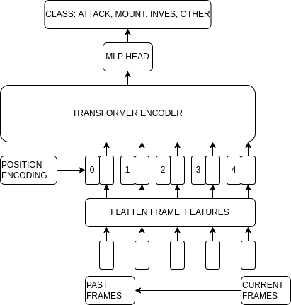
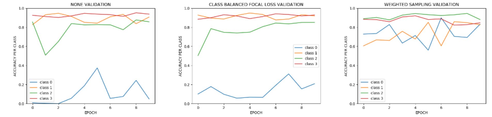

The experimental dataset utilized in this project include sets of keypoint frames of pairs of interacting mice with behavior classification of each frame.
During the original data collection, the animals were given the opportunity to freely interact under the careful supervision of the experimenter for several minutes.
The primary objective of this project was to develop a classification model capable of identifying the active behavior in each frame of a given sequence, based on the sequence's keypoint locations.
The keypoint locations corresponds to pose of each mouse in the frames of a video.
All labels are provided by a single annotator, and 4 possible behaviors are included: investigate, mount, attack, and other.
Given the time-based nature of the provided data, it was decided that a transformer based architecture would be the best fit for the required classification model.

One of the challenges encountered with the dataset was class imbalance.
Class imbalance occurs when the distribution of samples across different classes is significantly skewed, leading to biased model performance.
To address this issue, weighted sampling and class imbalance focal loss were implemented.

Class Balance Focal Loss (CBFL) manipulates how the loss metric is produced based on the class balance and the confidence of the model’s classification.
CBFL uses hard negative lining to give more weight (increased loss) to samples that are more difficult for the model to classify
This is useful because minority classes are more likely to be difficult for the model because they are sampled less often.
Samples are difficult for a model when it is less confident in its classification (outputs of its soft-max are close in value).
CBFL also directly considers the class balance of the data set by weighting each sample by the inverse of its class instance occurrence, that is, more class occurrences down weights the loss of a given sample.

Weighted Sampling (WS) is a training procedure that ensures training batches contain (on average) an even distribution for each class.
Batches were implemented by drawing samples from the data set (with replacement) pseudo randomly.
This strategy essentially resolves to oversampling the minority classes.
Due to sampling with replacement, we expect this strategy to have a higher risk of overfitting.

Fig. 1 -Depiction of Transformer model architecture

To get good performance it was important to take advantage of the sequential nature of the data set.
Transformers are a model architecture that uses self-attention to weight the significance of a given input sequence and embed sequential bias.
The architecture implementation is depicted in Figure 1.
The transformer’s training set was stacked to form 3 second sequences.
The sequences were constructed so that the last frame was the one the model was classifying.
This was done for each frame (frames towards the beginning of a video were padded with zeros if not enough previous frames existed).
So, the final number of training samples were not effected.
These sequences were then fed into the input of the transformer.
This concatenation allowed for the sequential context leading up to the final frame.
During training weighted sampling was used for class imbalance remediation.
Before being fed into the encoder of the transformer the input sequence features are flatten and embedded with a positional encoding.
The position encoding is implemented by superimposing sine and cosine signal over the frame features of the sequence.
This position encoding is used by the transformer encoder to determine the ordering of the input frames.
Our transformer encoder consisted of 4 serially connected encoder blocks.
Increasing the number of encoder blocks used in a transformer increases the expressiveness (representational capacity) of the model.
Each encoder layer consists of a 4 Attention heads terminated by feed-forward network.
The attention heads are used to distinguish relevant context among the past frames (or other inputs) that is useful for classifying the current frame.
Multiple attention heads allow the model to consider multiple contexts/frames simultaneously.
The output of the transformer is then fed into a fully connected classifier.
It was assumed that there would be a performance boost when the transformer was implemented.
However, there was also concerns about the increase in model complexity of the baseline model and what the would mean with respect to training feasibility.

Fig. 2 - Model accuracy on a per class basis. From left to right: (A) no class imbalance methodology implemented, (B) CBFL, and (C) weighted sampling.

The results of the class imbalance method experimentation can be seen in Figure 2.
During this experiment a fully connected network was used and the network only made predications while viewing a single frame.
Plot A of Figure 2 depicts the performance of the baseline model where no class imbalance strategy was implemented.

As expected, the model performs well on classes with a large percentages of samples (class 1 : investigation and class 4: other) and it performs poorly on a class with a small number of samples (class 0: attack).
Plot B depicts the performance of CBFL.
While the use of CBFL does improve the classification accuracy for class 0 the increase over plot A is minimal.
It was concluded that this lack of performance improvement can be attributed to the CBFL loss alterations not being aggressive enough to remedy the extreme data imbalance.
The loss function of CBFL allows for some hyper-parameter tuning that supports adjusting (increasing or decreasing) the loss caused by class imbalance in a given sample.
This avenue could be further explored in future work.
The weighted sampling (WS) methodology of plot C displays the best performance, with the accuracy of each class being 0.80 or above.
Unlike CBFL, WS guarantees that each class type is sampled equally.
This ensures that no over fitting to any class occurs due to overexposure.
Even though CBFL attempts to adjust its loss accordingly, the model is still much more often exposed to the majority classes, leading to over fitting of these classes.
A potential issue that can arise when using WS is over fitting to the minority class, due minority class re-sampling.
There was no evidence of this occurring during experimentation.

|===
|Approach|Average F1 Score
|Base |0.669
|Focal Loss |0.546
|Weighted sampling  |0.705
|Transformer |0.838
|===

Table 1: Class average F1 score was the metric used to evaluate success of each approach.

The transformer met performance expectations.
Its final performance F1 score of 0.838 outperformed our baseline model by slightly more 0.1.
This is to be expected since the transformer is much more expressive compared to the baseline model and it accounts for the sequential order of the data set.
However, due to its increased expressiveness, some over fitting did occur during training. The model’s final loss over the training set was 0.25 and the loss over the validation set was 0.3.
Resolving this over fitting can be part of future work.
However, it is currently concluded that this over fitting can be resolved by increasing the node dropout rate of the transformer and the weight decay of its optimizer.
While these results are promising it should be noted that this increased performance comes at the cost of significantly increased data and model complexity.
The transformer itself has a much higher parameter count when compared to out baseline model but the methodology of stacking up a rolling window of frames so that a sequence could be formed for the transformer used significant amount of RAM during training.
Many sequences sizes had to evaluated so that the overuse of RAM would not kill the training process.
